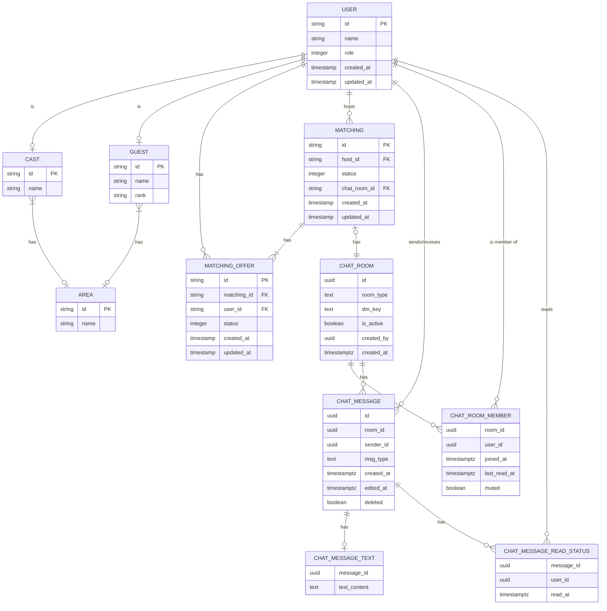

# ER図
- データベースの論理設計をここに記載します

```mermaid
erDiagram
		USER ||--o| CAST : "is"
		USER ||--o| GUEST : "is"
		USER ||--o{ MATCHING_OFFER : "has"
		USER ||--o{ MATCHING : "hosts"
		CAST }|--o| AREA : "has"
		GUEST }|--o| AREA : "has"
		MATCHING ||--|{ MATCHING_OFFER : "has"
		USER ||--o{ CHAT_MESSAGE : "sends/receives"
		MATCHING |o--|| CHAT_ROOM : "has"
		CHAT_ROOM ||--o{ CHAT_ROOM_MEMBER : "has"
		CHAT_ROOM ||--o{ CHAT_MESSAGE : "has"
		CHAT_MESSAGE ||--o| CHAT_MESSAGE_TEXT : "has"
		USER ||--o{ CHAT_ROOM_MEMBER : "is member of"
		CHAT_MESSAGE ||--o{ CHAT_MESSAGE_READ_STATUS : "has"
		USER ||--o{ CHAT_MESSAGE_READ_STATUS : "reads"

		MATCHING {
			string id PK
			string host_id FK
			integer status
			string chat_room_id FK
			timestamp created_at
			timestamp updated_at
		}
		GUEST {
			string id PK
			string name
			string rank
		}
		CAST {
			string id PK
			string name
		}
		USER {
			string id PK
			string name
			integer role
			timestamp created_at
			timestamp updated_at
		}
		AREA {
			string id PK
			string name
		}
		MATCHING_OFFER {
			string id PK
			string matching_id FK
			string user_id FK
			integer status
			timestamp created_at
			timestamp updated_at
		}

		CHAT_ROOM {
			uuid id
			text room_type
			text dm_key
			boolean is_active
			uuid created_by
			timestamptz created_at
		}

		CHAT_ROOM_MEMBER {
			uuid room_id
			uuid user_id
			timestamptz joined_at
			timestamptz last_read_at
			boolean muted
		}

		CHAT_MESSAGE {
			uuid id
			uuid room_id
			uuid sender_id
			text msg_type
			timestamptz created_at
			timestamptz edited_at
			boolean deleted
		}

		CHAT_MESSAGE_TEXT {
			uuid message_id
			text text_content
		}

		CHAT_MESSAGE_READ_STATUS {
			uuid message_id
			uuid user_id
			timestamptz read_at
		}
```